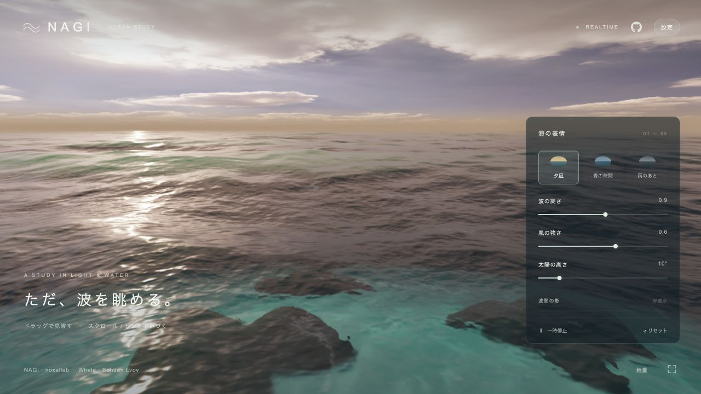
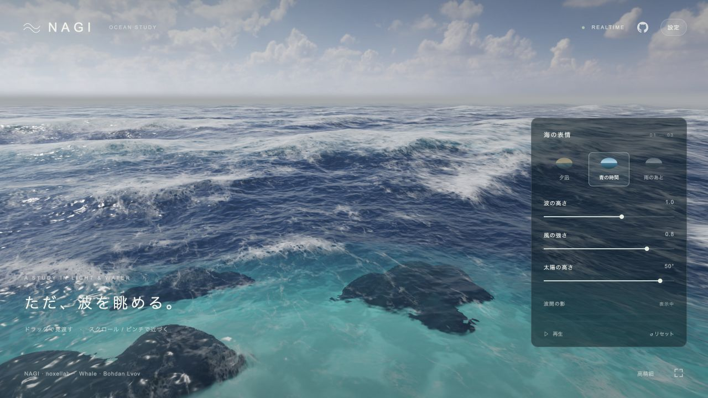
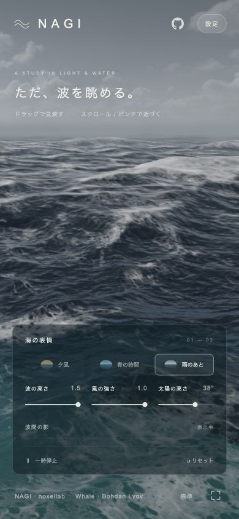

# Ocean

A Three.js and WebGL 2 ocean simulation with spectral waves, foam, refraction, environment lighting, and a swimming whale.

## Screenshots







The mobile screenshot uses a simulated 390 × 844 browser viewport, not a physical device.

## Setup

Requires Node.js `^24.15.0` or `>=26.0.0`.

```bash
npm ci
npm run dev
```

Open the displayed local URL in a WebGL 2 compatible browser.

## Controls

- Drag: move the viewpoint
- Scroll or pinch: adjust the camera height
- `Space`: play or pause
- `H`: show or hide the settings panel
- **Settings** (`設定`): choose the scene and adjust waves, wind, sun, and rendering quality
- **Shadow between the waves** (`波間の影`): show or hide the whale

## Verification

```bash
npm test
npm run build
```

## Credits and license

Based on [`noxellab/nagi-ocean-sim` at `16c552b`](https://github.com/noxellab/nagi-ocean-sim/commit/16c552b1eda48249b23d633617d67127fe7755c1).

- Code and foam image: [MIT License](./LICENSE)
- Sky images and radiance data: [CC0 1.0](https://creativecommons.org/publicdomain/zero/1.0/)
- Whale model: [“Blue Whale - Textured” by Bohdan Lvov, CC BY 4.0](./public/BLUE_WHALE_ATTRIBUTION.txt)
- Third-party notices: [THIRD_PARTY_NOTICES.txt](./THIRD_PARTY_NOTICES.txt)
